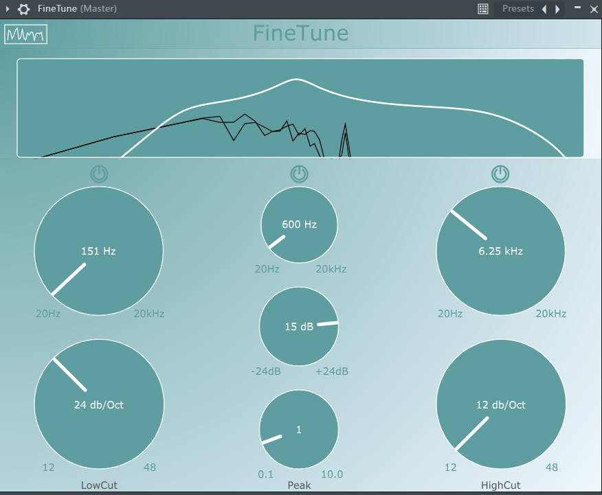
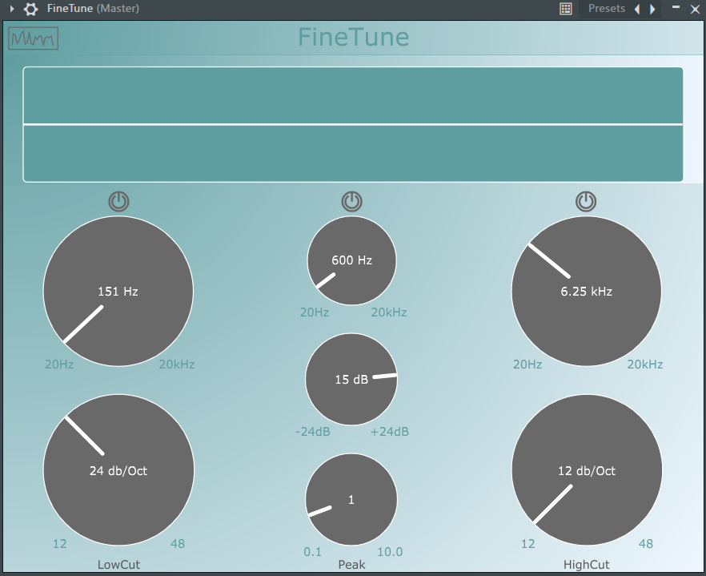

<a id="readme-top"></a>

<!-- PROJECT LOGO -->
# FineTune
<br />

<div align="center">
  <p align="center" style="font-size: 24px">
    A lightweight 3-band equalizer audio plugin.
    <br />
    <br />
  </p>
</div>

<!-- TABLE OF CONTENTS -->
<details>
  <summary>Table of Contents</summary>
  <ol>
    <li>
      <a href="#about-the-project">About The Project</a>
      <ul>
        <li><a href="#features">Features</a></li>
        <li><a href="#built-with">Built With</a></li>
      </ul>
    </li>
    <li>
      <a href="#screenshots">Screenshots</a>
    </li>
    <li>
      <a href="#getting-started">Getting Started</a>
    </li>
  </ol>
</details>

<!-- ABOUT THE PROJECT -->

# About The Project

FineTune is a lightweight 3-band equalizer designed to help users shape their sound with ease. Whether you're cutting out unwanted frequencies or enhancing your audio mix, FineTune provides a simple yet effective solution with an intuitive UI.

### Why FineTune?
Throughout college, I had a low-budget laptop that struggled with resource-heavy audio software. I needed a lightweight equalizer that allowed me to work on music without crashes or lag. FineTune was built with efficiency in mind, ensuring smooth performance even on modest hardware.

### Features
- **3-Band Equalizer** – Adjust low, mid, and high frequencies.
- **Lightweight & Fast** – Designed for performance on low-spec machines.
- **User-Friendly UI** – Simple and intuitive controls for quick adjustments.
- **Real-Time Processing** – Hear the changes instantly as you tweak the settings.

### Built With
- C++
- JUCE Framework

<!-- SCREENSHOTS -->

# Screenshots

### Main Interface


### Bypassed


<p align="right">(<a href="#readme-top">back to top</a>)</p>

<!-- GETTING STARTED -->

# Getting Started

## Installation
1. Clone the repository:
   ```sh
   git clone https://github.com/JonathanBY15/3-Band-Eq
   ```
2. Install JUCE:
   - Download JUCE from [JUCE's official website](https://juce.com/).
   - Follow the installation instructions for your OS.
3. Open the project in JUCE's Projucer and configure the desired plugin format (VST/AU).
4. Build the project using an appropriate IDE (Xcode, Visual Studio, or CLion).
5. Load FineTune in your DAW and start shaping your sound!

## Usage
1. Load FineTune as an audio effect in your DAW.
2. Adjust the Low, Mid, and High frequency sliders to shape your sound.
3. Use the bypass switch to compare before and after adjustments.
4. Fine-tune your mix without worrying about CPU overload!

